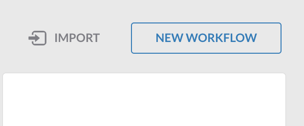
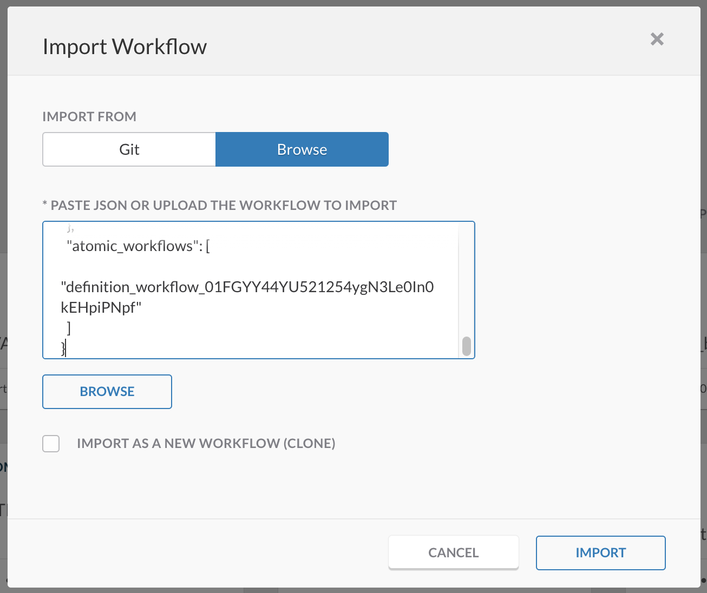

# MISP SecureX Orchestration Workflows

> **NOTE**: If you are using Cisco XDR, please use [MISP Events to Cisco XDR Incident and Ticketing System](https://github.com/CiscoDevNet/cisco-xdr-misp-threat-hunting-automation).

## Features
*	Import events from [MISP](https://www.circl.lu/doc/misp/automation/) into SecureX.
*	Automatically enrich observables and search for potential targets with Cisco Threat Response.
*	Send observables to Private intel database within SecureX and connect this feed to your security solutions. 
*	Auto create an incident within the SecureX Incident manager.
*	Post sightings to a webex space (this can be any destination of choice, Email, MS teams, Ticketing system etc.).

> **Note:** Please test this properly before implementing in a production environment. This is a sample workflow!

## Required Targets
- CTR_For_Access_Token (default)
- CTR_API (default)
- MISP API ([SecureX Orchestration Remote Connector](https://ciscosecurity.github.io/sxo-05-security-workflows/remote/) may be needed)
- Webex Teams (optional)

## Required Account Keys
- CTR_Credentials (default)
- [MISP API Keys](https://www.circl.lu/doc/misp/automation/)
- Webex Teams Token (optional)

## Required Atomic Workflows
- Threat Response - Generate Access Token (System Atomic - No Import Needed)
- Threat Response - Deliberate Observable (System Atomic - No Import Needed)
- Threat Response - Enrich Observable (System Atomic - No Import Needed)
- Threat Response - Create Sighting (System Atomic - No Import Needed)
- Threat Response - Create Incident (System Atomic - No Import Needed)
- Threat Response - Create Relationship (System Atomic - No Import Needed)
- Webex Teams - Post Message to Room (System Atomic - No Import Needed)

## Setup instructions

### Configure Global Variables

1. Browse to your SecureX orchestration instance. This wille be a different URL depending on the region your account is in: 

* US: https://securex-ao.us.security.cisco.com/orch-ui/workflows/
* EU: https://securex-ao.eu.security.cisco.com/orch-ui/workflows/
* APJC: https://securex-ao.apjc.security.cisco.com/orch-ui/workflows/

2. In the left pane menu, select **Workflows**. Click on **IMPORT** to import the workflow:

3. Click on **Browse** and copy paste the content of the [misp-event-to-incident-workflow.json](https://raw.githubusercontent.com/CiscoDevNet/MISP-SecureX-Orchestration-Workflows/main/misp-event-to-incident-workflow.json) file inside of the text window. Select **IMPORT AS A NEW WORKFLOW (CLONE)** and click on **IMPORT**.

4. Make sure you have filled in the MISP HTTP Target and API Credentials in the `MISP-GET-EVENTS` activity. 

5. Make sure the `Webex Teams - Post Message to Room` has the correct Access Token and Room ID. It is recommended to use a **Webex Bot** to create an **Access Token**. Please find more information regarding Webex Bots in the [Webex developer documentation](https://developer.webex.com/docs/bots). 

## Notes

* Please test this properly before implementing in a production environment. This is a sample workflow!
* In a future version more reporting actions will be added upon a target sighting.

## Author(s)

* Pieter van Schaik (Cisco)
* Maarten Lutterman (Cisco)
* Christopher van der Made (Cisco)
